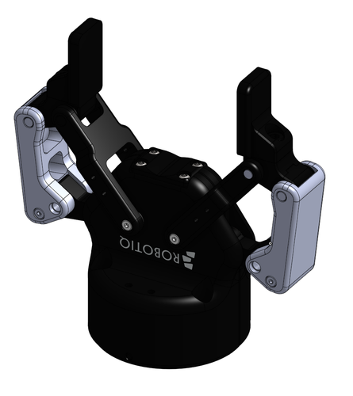
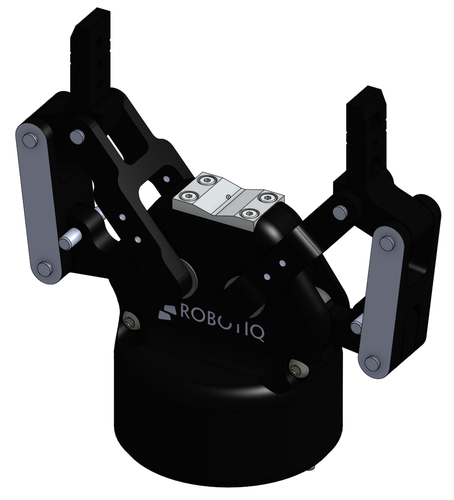
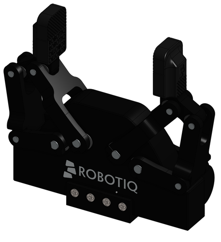

# Robotiq 2F-85 V4

This is the latest version of the Robotiq 2F-85 (v4), which has been sold since 2019.

There are 4 hardware revisions of the Robotiq 2F-85. The 3 and 4 are easily confused, but have different dimensions and weights. Almost all online models are of the v3. You probably have a v4.

## Reference Images

| Image | Version | Release Date |
| --- | --- | --- |
|  | v4 | 2019 |
|  | v3 | Unknown (discontinued in 2019). Pictured without finger pads. |
|  | v2 | Unknown |

## History

This repository was [forked](https://github.com/au-rmr/robotiq) from the [old ROS INdustrial Robotiq repo](https://github.com/ros-industrial-attic/robotiq) the Amazon-UW Robotic Manipulation Research (AURMR) effort. I extracted just the 2F-85 packages as these are the ones we cleaned up, and the gripper is in widespread use.